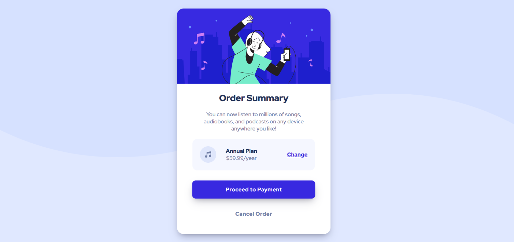

# Frontend Mentor - Order summary card solution

This is a solution to the [Order summary card challenge on Frontend Mentor](https://www.frontendmentor.io/challenges/order-summary-component-QlPmajDUj). Frontend Mentor challenges help you improve your coding skills by building realistic projects. 

## Table of contents

- [Overview](#overview)
  - [The challenge](#the-challenge)
  - [Screenshot](#screenshot)
  - [Links](#links)
- [My process](#my-process)
  - [Built with](#built-with)
  - [What I learned](#what-i-learned)
  - [Continued development](#continued-development)
  - [Useful resources](#useful-resources)
- [Author](#author)

## Overview

### The challenge

Users should be able to:

- See hover states for interactive elements

### Screenshot

### Links

- Solution URL: [GitHub](https://github.com/mitch-webdev/order-summary-component)
- Live Site URL: [GitHub Pages](https://your-live-site-url.com)

## My process

### Built with

- Semantic HTML5 markup
- CSS custom properties
- Flexbox

### What I learned

I learned to create a complete page without watching a tutorial which makes it much harder. However, harder didn't mean I wanted to give up. In the contrary, I just wanted to make it work so I just kept on trying until it worked!

### Continued development

This project showed me that I can actually make it work by myself, without watching a tutorial. Of course, I still have a huge amount of stuff to learn. Therefore, I will continue learning CSS deeper in order to apply it better than I did because I'm pretty sure there is some unnecessary code in my project.

### Useful resources

- [CSS Tricks](https://css-tricks.com/) - Helps me a lot when using flexbox.
- [W3 Schools](https://www.w3schools.com/) - My go to when coding.

## Author

- Frontend Mentor - [@mitch-webdev](https://www.frontendmentor.io/profile/mitch-webdev)
